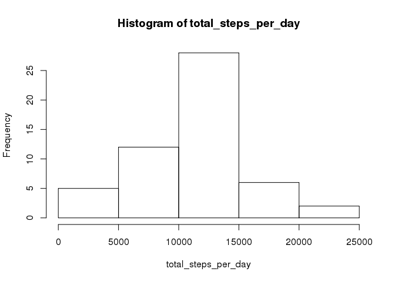
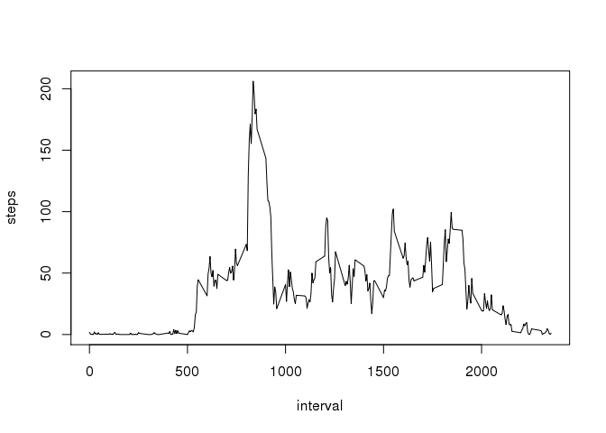
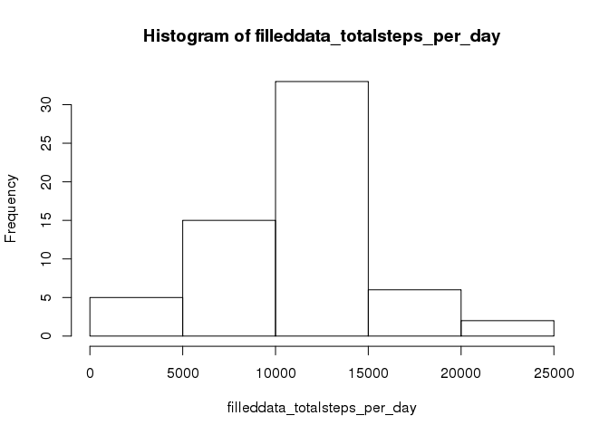
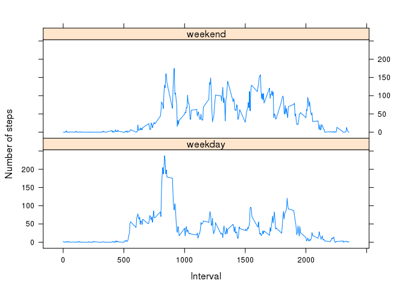

# Reproducible Research: Peer Assessment 1
Xiaoya Zhu  
03/11/2015  


## Set global options and load library


```r
library(knitr)
library(lattice)
library(lubridate)
library(dplyr)
```

```
## 
## Attaching package: 'dplyr'
## 
## The following objects are masked from 'package:lubridate':
## 
##     intersect, setdiff, union
## 
## The following object is masked from 'package:stats':
## 
##     filter
## 
## The following objects are masked from 'package:base':
## 
##     intersect, setdiff, setequal, union
```

```r
opts_chunk$set(echo = TRUE, PATH="./figure/")
```

## Loading and preprocessing the data

1. Download file, unzip it and load to data.

```r
fileURL <- "https://d396qusza40orc.cloudfront.net/repdata%2Fdata%2Factivity.zip"
zipfile="activity.zip"
download.file(fileURL, destfile=zipfile, method="curl")
unzip(zipfile, exdir="./")
data <- read.csv("./activity.csv", header = T)
```
2. process data, add wday (value 1:7) and remove NA to create dataset data_clean.

```r
data$wday <- wday(data$date)
head(data)
```

```
##   steps       date interval wday
## 1    NA 2012-10-01        0    2
## 2    NA 2012-10-01        5    2
## 3    NA 2012-10-01       10    2
## 4    NA 2012-10-01       15    2
## 5    NA 2012-10-01       20    2
## 6    NA 2012-10-01       25    2
```

```r
data_clean <- filter(data, !is.na(steps))
```

## What is mean total number of steps taken per day?

1. Calculate the total number of steps taken per day

```r
total_steps_per_day <- aggregate(steps~date, data, sum, na.action = na.omit)$steps
```
2.  Make a histogram of the total number of steps taken each day

```r
hist(total_steps_per_day)
```

 

3. Calculate and report the mean and median of the total number of steps taken per day

```r
mean_totalsteps_perday <- mean(total_steps_per_day)
median_totalsteps_perday <- median(total_steps_per_day)
```
Mean of the total number of steps taken per day  

```r
mean_totalsteps_perday
```

```
## [1] 10766.19
```
Median of the total number of steps taken per day 

```r
median_totalsteps_perday
```

```
## [1] 10765
```

 

## What is the average daily activity pattern?

1. Make a time series plot (i.e. type = "l") of the 5-minute interval (x-axis) and the average number of steps taken, averaged across all days (y-axis)

```r
average_steps_by_interval <- aggregate(steps ~ interval, data, mean, na.action = na.omit)
plot(average_steps_by_interval, type = "l")
```

 

2. Which 5-minute interval, on average across all the days in the dataset, contains the maximum number of steps?

```r
max_summary <- summary(average_steps_by_interval)
max_summary
```

```
##     interval          steps        
##  Min.   :   0.0   Min.   :  0.000  
##  1st Qu.: 588.8   1st Qu.:  2.486  
##  Median :1177.5   Median : 34.113  
##  Mean   :1177.5   Mean   : 37.383  
##  3rd Qu.:1766.2   3rd Qu.: 52.835  
##  Max.   :2355.0   Max.   :206.170
```
5-minute interval with maximun average steps is :

```r
max_summary[6,1]
```

```
## [1] "Max.   :2355.0  "
```

## Imputing missing values

1. Calculate and report the total number of missing values in the dataset (i.e. the total number of rows with NAs)

```r
sum(is.na(data$steps))
```

```
## [1] 2304
```
2.  Filling in all of the missing values in the dataset with average steps per 5 minute interval per weekday(1-7). 

```r
by_interval_wday <- group_by(data_clean, interval, wday)
mean_by_interval_wday <- summarise(by_interval_wday,mean=mean(steps))
merged <- merge(data, mean_by_interval_wday, by=c("interval", "wday"))
merged[is.na(merged$steps), 3] <- merged[is.na(merged$steps), 5]
```
  3. Create a new dataset that is equal to the original dataset but with the missing data filled in. 

```r
filleddata  <- merged[, c(3,4,1,2)]
sort_filleddata <- filleddata[order(filleddata$date, filleddata$interval),]
head(sort_filleddata)
```

```
##          steps       date interval wday
## 9     1.428571 2012-10-01        0    2
## 13736 0.000000 2012-10-01        5    2
## 72    0.000000 2012-10-01       10    2
## 4401  0.000000 2012-10-01       15    2
## 8244  0.000000 2012-10-01       20    2
## 11843 5.000000 2012-10-01       25    2
```
  4. Make a histogram of the total number of steps taken each day.

```r
filleddata_totalsteps_per_day <- aggregate(steps~date, filleddata, sum)$steps
hist(filleddata_totalsteps_per_day)
```

 
  
  5. Calculate and report the mean and median total number of steps taken per day

```r
estimate_mean_totalsteps_perday <- mean(filleddata_totalsteps_per_day)
estimate_median_totalsteps_perday <- median(filleddata_totalsteps_per_day)
```
Mean of total number of steps taken per day

```r
estimate_mean_totalsteps_perday
```

```
## [1] 10821.21
```

Median total number of steps taken per day

```r
estimate_median_totalsteps_perday
```

```
## [1] 11015
```

6. Do these values differ from the estimates from the first part of the assignment? What is the impact of imputing missing data on the estimates of the total daily number of steps?

```r
diff <- matrix(c(mean_totalsteps_perday,median_totalsteps_perday,estimate_mean_totalsteps_perday,estimate_median_totalsteps_perday), nrow=2, ncol=2)
colnames(diff) <- c("Data", "FilledData")
rownames(diff) <- c("Mean",  "Median")
diff
```

```
##            Data FilledData
## Mean   10766.19   10821.21
## Median 10765.00   11015.00
```

## Are there differences in activity patterns between weekdays and weekends?

1. Change wday variable to a factor variable with two levels weekday and weekend indicating whether a given date is a weekday or weekend day

```r
filleddata[filleddata$wday %in% c(1,7), 4] <- "weekend"
filleddata[filleddata$wday %in% 2:6, 4] <- "weekday"
filleddata$wday <- factor(filleddata$wday)
```
2. Make a panel plot containing a time series plot (i.e. type = "l") of the 5-minute interval (x-axis) and the average number of steps taken, averaged across all weekday days or weekend days (y-axis).

```r
filleddata_by_interval_wday <- group_by(filleddata, interval, wday)
summary_filleddata_by_interval_wday <- summarise(filleddata_by_interval_wday,mean=mean(steps))
xyplot(
        type="l",
        data=summary_filleddata_by_interval_wday,
        mean ~ interval | wday,
        xlab="Interval",
        ylab="Number of steps",
        layout=c(1,2)
)
```

 


